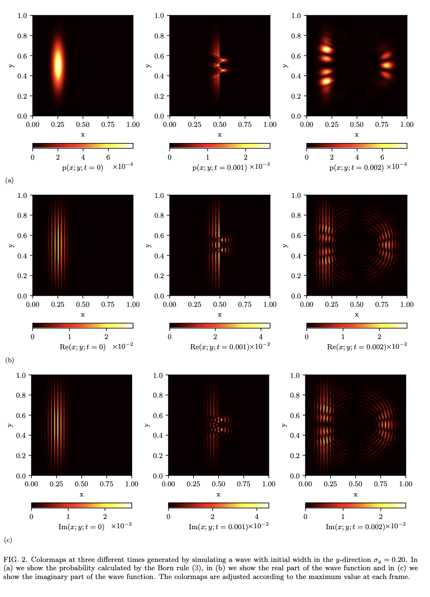

Around a week ago my friend and I finished the last of three graded studies for a [computational physics course](https://www.uio.no/studier/emner/matnat/fys/FYS3150/) at the University of Oslo (UiO). Out of all three, this study was comparably easier, as the necesssary theory still lay quite fresh from the previous semester. Given the assumption that our definitions for quantum states and probabilities were well defined (even though their true nature still eludes us), understanding the double-slit experiment proved to be surprisingly intuitive. By applying some math, computer **magic**, and some theoretical hubris, I would say that the study yielded a fair visualization of the intricate interplay between wave-and particle characteristics.

The method of the study entailed solving and implementing partial differential equations (PDEs), such that a numerical method could be applied to the time-dependent [Schrödinger equation](https://en.wikipedia.org/wiki/Schrödinger_equation) to explore the time-evolution of a double-slit experiment. More importantly however the purpose and intent of the study was to probe the realm of quantum mechanics, and garner a better understanding of how matter and energy satisfy the seemingly incongruous classical definitions for both waves *and* particles.

A few color maps of the double-slit experiment a different times, for three different cases. Here **a)** is the case where we calculated the probability using the [Born rule](https://en.wikipedia.org/wiki/Born_rule), while **b)** and **c)** correspond to the real and imaginary parts of the wave function respectively.

